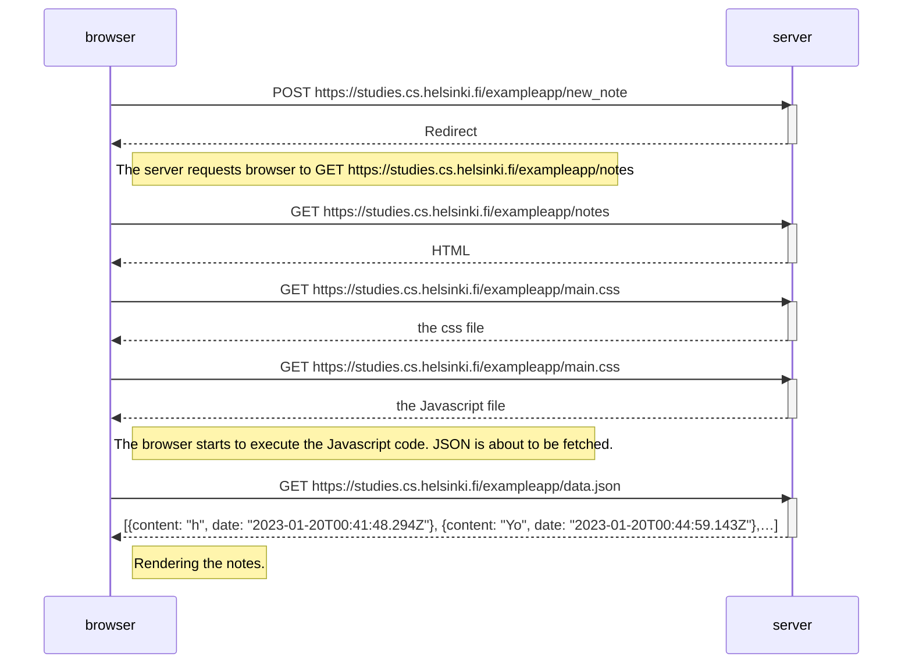

```mermaid
sequenceDiagram
    participant browser
    participant server
    
    browser->>server: POST https://studies.cs.helsinki.fi/exampleapp/new_note
    activate server
    server-->>browser: Redirect
    deactivate server

    Note right of browser: The server requests browser to GET https://studies.cs.helsinki.fi/exampleapp/notes 
    
    browser->>server: GET https://studies.cs.helsinki.fi/exampleapp/notes
    activate server
    server-->>browser: HTML
    deactivate server
    
    browser->>server: GET https://studies.cs.helsinki.fi/exampleapp/main.css
    activate server
    server-->>browser: the css file
    deactivate server
    
    browser->>server: GET https://studies.cs.helsinki.fi/exampleapp/main.css
    activate server
    server-->>browser: the Javascript file
    deactivate server
    
    Note right of browser: The browser starts to execute the Javascript code. JSON is about to be fetched.
    
    browser->>server: GET https://studies.cs.helsinki.fi/exampleapp/data.json
    activate server
    server-->>browser: [{content: "h", date: "2023-01-20T00:41:48.294Z"}, {content: "Yo", date: "2023-01-20T00:44:59.143Z"},…]
    deactivate server   


    Note right of browser: Rendering the notes.
```